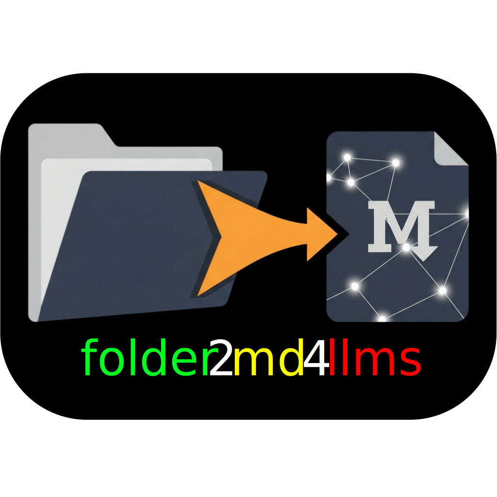

# folder2md4llms



[](https://github.com/henriqueslab/folder2md4llms/actions/workflows/test.yml)
[](https://github.com/henriqueslab/folder2md4llms/actions/workflows/release.yml)
[](https://pypi.org/project/folder2md4llms/)
[](https://www.python.org/downloads/)
[](https://opensource.org/licenses/MIT)
[](https://pypi.org/project/folder2md4llms/)

`folder2md4llms` is a powerful and flexible tool that converts a repository's contents into a single, LLM-friendly Markdown file. It's designed to be fast, configurable, and easy to use, with a focus on producing high-quality, structured output.

## ✨ Key Features

- **Smart Condensing**: Automatically condenses code to fit within a specified token or character limit without crude truncation.
- **Document Conversion**: Converts PDF, DOCX, XLSX, and other document formats into text.
- **Binary File Analysis**: Provides intelligent descriptions for images, archives, and other binary files.
- **Highly Configurable**: Use a `folder2md.yaml` file or command-line options to customize the output.
- **Fast and Efficient**: Leverages multi-threading and efficient file processing to handle large repositories quickly.
- **Advanced Filtering**: Uses `.gitignore`-style patterns to exclude files and directories.

## 🚀 Installation

**Quick Installation (All Platforms):**

```bash
# Using pipx (recommended)
pipx install folder2md4llms

# Verify installation
folder2md --help
```

**Need platform-specific setup?** 📖 **[Complete Installation Guide →](docs/installation.md)**

> **⚠️ Important:** The package name is `folder2md4llms` but the command is `folder2md`

#### 🚀 Binary Installation (Alternative)
**No Python required - standalone executable**

**Manual Binary Installation:**
1. Download the appropriate binary from [GitHub Releases](https://github.com/henriqueslab/folder2md4llms/releases/latest):
   - **macOS**: `folder2md-macos-x64` (Intel) or `folder2md-macos-arm64` (Apple Silicon)
   - **Windows**: `folder2md-windows-x64.exe`
   - **Linux**: Coming soon
2. Make executable (macOS/Linux): `chmod +x folder2md-*`
3. Move to PATH:
   - **macOS/Linux**: `sudo mv folder2md-* /usr/local/bin/folder2md`
   - **Windows**:
     ```powershell
     # Option 1: Move to a directory already in PATH
     Move-Item folder2md-windows-x64.exe $env:USERPROFILE\AppData\Local\Microsoft\WindowsApps\folder2md.exe

     # Option 2: Create a dedicated folder and add to PATH
     New-Item -ItemType Directory -Force -Path "$env:USERPROFILE\bin"
     Move-Item folder2md-windows-x64.exe "$env:USERPROFILE\bin\folder2md.exe"
     # Then add $env:USERPROFILE\bin to your PATH in System Environment Variables
     ```

##### ⚠️ macOS Security Note (Binary Only)

When you first run the binary on macOS, you may see a security warning. This is normal for unsigned binaries. **Note:** Python package installation avoids this entirely.

**Method 1: System Settings**
1. Try to run the binary (it will be blocked)
2. Go to System Settings → Privacy & Security
3. Look for "folder2md-macos-* was blocked..."
4. Click "Allow Anyway"
5. Try running again and click "Open"

**Method 2: Command line (for advanced users)**
```bash
xattr -c folder2md-macos-*
```

**Why this happens:** macOS Gatekeeper blocks unsigned binaries by default. This is normal for open-source tools distributed as binaries.

### Basic Usage

```bash
# Process the current directory and save to output.md
folder2md .

# Process a specific directory and set a token limit
folder2md /path/to/repo --limit 80000t

# Copy the output to the clipboard
folder2md /path/to/repo --clipboard

# Generate a .folder2md_ignore file
folder2md --init-ignore
```

For a full list of commands and options, see the [CLI Reference](docs/api.md) or run `folder2md --help`.

> **Note**: The package name is `folder2md4llms` but the command is `folder2md` for convenience.

## 🚨 Troubleshooting

### Common Installation Issues

#### "No matching distribution found for folder2md"

**Problem**: You're trying to install `folder2md` instead of the correct package name.

**Solution**: Use the full package name `folder2md4llms`:
```bash
# ❌ Wrong
pip install folder2md
pipx install folder2md

# ✅ Correct
pipx install folder2md4llms
pip install folder2md4llms
```

#### "Command 'folder2md' not found" after installation

**Problem**: After installation, the `folder2md` command isn't available in your PATH.

**Solution**: Check your installation method:
```bash
# Using pipx (recommended)
pipx install folder2md4llms
pipx list  # Verify installation

# If pipx isn't in PATH, try:
python -m pipx install folder2md4llms

# Alternative: Use pip with --user
pip install --user folder2md4llms

# If still not found, use full path:
python -m folder2md4llms .
```

#### "pipx not found"

**Problem**: pipx is not installed on your system.

**Solution**: Install pipx first:
```bash
# Using pip
pip install pipx

# Or using your system package manager:
# Ubuntu/Debian: sudo apt install pipx
# macOS: brew install pipx
# Windows: Use pip method above
```

### Platform-Specific Issues

#### Windows: PowerShell Execution Policy

```powershell
# If you get execution policy errors:
Set-ExecutionPolicy -ExecutionPolicy RemoteSigned -Scope CurrentUser
```

#### macOS: Security Warnings for Binary

See the [macOS Security Note](#️-macos-security-note-binary-only) above for detailed solutions.

#### Linux: Permission Denied

```bash
# Make binary executable
chmod +x folder2md-linux-*
# Move to PATH with proper permissions
sudo mv folder2md-linux-* /usr/local/bin/folder2md
```

### Getting Help

- **Command help**: `folder2md --help`
- **Version check**: `folder2md --version`
- **Alternative**: `python -m folder2md4llms --help` (works without installation)
- **Report issues**: [GitHub Issues](https://github.com/henriqueslab/folder2md4llms/issues)
- **Discussions**: [GitHub Discussions](https://github.com/henriqueslab/folder2md4llms/discussions)

## 🔧 Configuration

You can configure `folder2md4llms` by creating a `folder2md.yaml` file in your repository's root directory. This allows you to set advanced options and define custom behavior.

For more details, see the [Configuration Guide](docs/api.md#configuration).

## 🛠️ Development

Interested in contributing? Get started with these simple steps:

```bash
# Clone the repository
git clone https://github.com/henriqueslab/folder2md4llms.git
cd folder2md4llms

# Set up the development environment
make setup

# See all available commands
make help
```

## 🤝 Contributing

Contributions are welcome! Please feel free to submit a Pull Request. For more information, see the [Contributing Guidelines](CONTRIBUTING.md).

## 📖 Documentation

- **[CLI Reference](docs/api.md)** - Complete command-line reference
- **[Contributing Guidelines](CONTRIBUTING.md)** - How to contribute to the project
- **[Changelog](CHANGELOG.md)** - Version history and changes

## 📦 Distribution Channels

- **PyPI**: [folder2md4llms](https://pypi.org/project/folder2md4llms/) - Python package
- **GitHub Releases**: [Binary downloads](https://github.com/henriqueslab/folder2md4llms/releases) - Standalone executables

## 📄 License

This project is licensed under the MIT License - see the [LICENSE](LICENSE) file for details.
